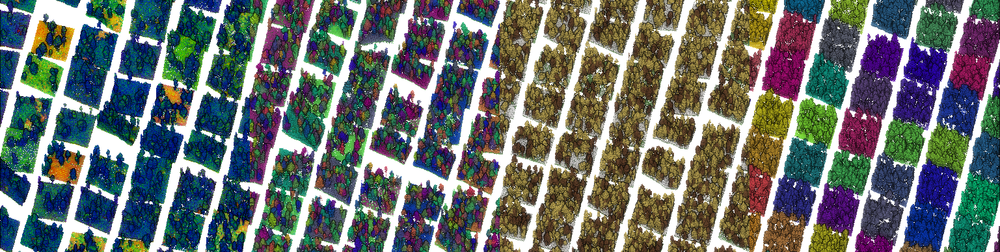

# QC-SF x PTv3
This repo is the offical repo for the adapted version of Point Transformer v3 for QC-SF dataset based on :
- [Point Transformer V3](https://github.com/Pointcept/PointTransformerV3?tab=readme-ov-file) (version [fcc79d1](https://github.com/Pointcept/PointTransformerV3/tree/fcc79d1fba8b0cad3b0b81703fe69db576cad9b2))
- [Pointcept](https://github.com/Pointcept/Pointcept) (version [df36980](https://github.com/Pointcept/Pointcept/tree/df36980119f4636beb2d02d04ef3b2fec0fddfba))
